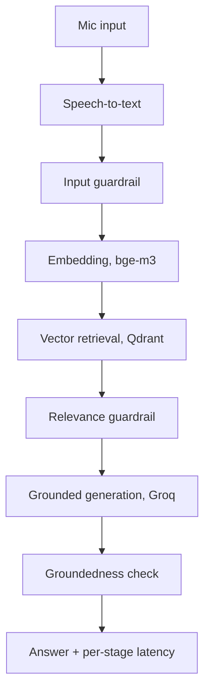

# Voice-Enabled RAG: Hindi + English

A voice-in, grounded-answer-out RAG pipeline over the Hindi and English content in
[`ai4bharat/MSMARCO-XI`](https://huggingface.co/datasets/ai4bharat/MSMARCO-XI), built at **$0 cost**.

Speak a question in Hindi or English, and the pipeline turns it into text, retrieves
relevant passages from a bilingual vector index, and generates a cited answer in the
same language, refusing to answer when it isn't confident. Every stage is timed, so
the latency numbers reported later are measured, not estimated.

**Status:** Phase 0 complete (bootstrap). See [docs/roadmap.md](docs/roadmap.md) for
the full phased plan and current progress.

## How it works



Full architecture, including the dependency direction between layers, lives in
[docs/architecture.md](docs/architecture.md).

## Ground rules

- **$0 spend, guaranteed.** Every component is free-tier or fully local and open-source.
- **Two languages, done properly.** Hindi and English are both first-class in V1, not one primary language with the other bolted on.
- **Lean architecture.** One domain, application, infrastructure, presentation layering for the whole app. No duplicated scaffolding per component.
- **Core loop before hardening.** No auth, no Postgres, no Kubernetes, no deployment pipeline until the RAG loop works end to end.
- **Honest numbers over impressive-sounding ones.** Latency gets reported per stage, not as a single headline figure.

## Setup

```bash
uv sync --extra dev
cp .env.example .env
docker compose up -d
```

Verify the config loads:

```bash
uv run python -c "from voicerag.config import settings; print(settings)"
```

## Testing

```bash
uv run pytest tests/unit
```

Integration tests that hit real APIs will be gated behind an environment variable once
they exist, the same way `ai-search-chatbot` gates its integration suite.

<details>
<summary>Project structure</summary>

```
src/voicerag/
├── domain/
│   ├── entities.py       # Query, Transcript, Chunk, RetrievedPassage, Answer, EvalResult
│   └── interfaces.py     # SpeechToTextProvider, Embedder, VectorStore, LLMProvider
├── application/           # orchestrator, chunking strategies, guardrails (Phases 1-4)
├── infrastructure/         # Sarvam, whisper, bge-m3, Qdrant, Groq (Phases 2-4)
├── presentation/            # CLI, Streamlit (Phase 6)
└── config.py               # pydantic-settings

tests/
├── unit/
└── integration/

docs/
├── architecture.md
├── decisions.md
├── roadmap.md
└── phases/                  # one file per build phase
```

</details>

## Documentation

- [docs/architecture.md](docs/architecture.md): pipeline, layering, component responsibilities
- [docs/decisions.md](docs/decisions.md): numbered design decisions with dates and reasoning
- [docs/roadmap.md](docs/roadmap.md): phase-by-phase plan and checklist
- [docs/phases/](docs/phases/): a detailed write-up per completed phase
- [DEVLOG.md](DEVLOG.md): a lighter, session-by-session journal

## License

MIT. See [LICENSE](LICENSE).
