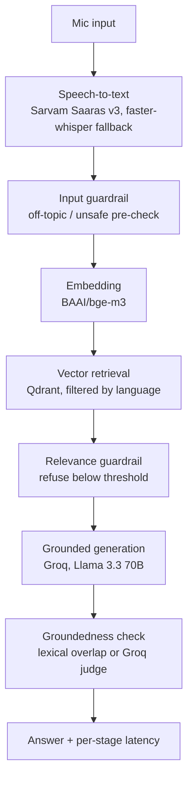

# Voice-Enabled RAG: Architecture

See [roadmap.md](roadmap.md) for the phased build order and [decisions.md](decisions.md) for the reasoning behind individual choices.

## Objective

Take a spoken question in Hindi or English and return a grounded, cited answer in the same language, with every stage measured so the latency numbers in the eventual README are real, not estimated. The two languages share one pipeline end to end: language is a metadata tag on a chunk, not a branch in the code.

## Pipeline



Every stage carries a timer and a correlation ID from the moment audio comes in, so the latency report at the end is an aggregation of numbers already being collected, not something bolted on afterward.

## Layering

| Layer | Contains | Depends on |
|---|---|---|
| `domain/` | Entities (`Query`, `Transcript`, `Chunk`, ...) and interfaces (`SpeechToTextProvider`, `Embedder`, ...) | Nothing |
| `application/` | `VoiceRAGPipeline` orchestrator, chunking strategies, guardrail logic | `domain/` only |
| `infrastructure/` | Concrete providers: Sarvam, whisper, bge-m3, Qdrant, Groq | `domain/` (implements its interfaces) |
| `presentation/` | CLI, and Streamlit if time allows | `application/` |

Dependencies point inward. `domain/` never imports from any other layer, so the core entities and contracts stay stable while providers underneath them can be swapped.

## Folder structure

```
src/voicerag/
├── domain/
│   ├── entities.py      # Query, Transcript, Chunk, RetrievedPassage, Answer, EvalResult
│   └── interfaces.py    # SpeechToTextProvider, Embedder, VectorStore, LLMProvider
├── application/
│   ├── pipeline.py       # VoiceRAGPipeline orchestrator (Phase 4)
│   ├── chunking/          # fixed_size, sentence_window, semantic_grouped (Phase 1)
│   └── guardrails.py      # relevance, unsafe-input, groundedness checks (Phase 4)
├── infrastructure/
│   ├── stt/                # sarvam_provider.py, whisper_local_provider.py (Phase 3)
│   ├── embeddings/          # bge_m3_embedder.py (Phase 2)
│   ├── vectorstore/          # qdrant_store.py (Phase 2)
│   └── llm/                   # groq_client.py (Phase 4)
├── presentation/
│   ├── cli.py            # Phase 6
│   └── streamlit_app.py   # Phase 6, if time allows
└── config.py              # pydantic-settings, done in Phase 0
```

Subpackages under `application/` and `infrastructure/` get created when the phase that needs them actually adds code to them, not ahead of time.

## Component responsibilities

| Component | Responsibility | Why it's separate |
|---|---|---|
| `SpeechToTextProvider` | Turn audio into a `Transcript` | Two providers exist (Sarvam, local whisper) behind the same call, so the pipeline never checks which one is active |
| `Embedder` | Turn text into a vector | bge-m3 is multilingual by construction; if that ever changes, only this file changes |
| `VectorStore` | Store and search chunk vectors | Qdrant specifics (client, collection setup) stay out of application code |
| `LLMProvider` | Turn a query and retrieved passages into an `Answer` | Keeps prompt construction and Groq's request shape out of the orchestrator |
| Chunking strategies | Split passages into indexable units, one implementation per strategy | The whole point of Phase 1 is comparing them; each needs to be swappable independently |
| Guardrails | Relevance threshold, unsafe-input check, groundedness check | Pure logic, no external SDK, lives in `application/` rather than behind a provider interface. See Decision 0.3. |

## Vector store layout

One Qdrant collection holds both languages. Each point carries a `language` payload field (`"en"` or `"hi"`), plus `source_query_id`, `is_selected`, and `chunking_strategy`. Retrieval filters by language at query time rather than maintaining two collections, which keeps the retrieval code identical regardless of which language the transcribed question comes in.
